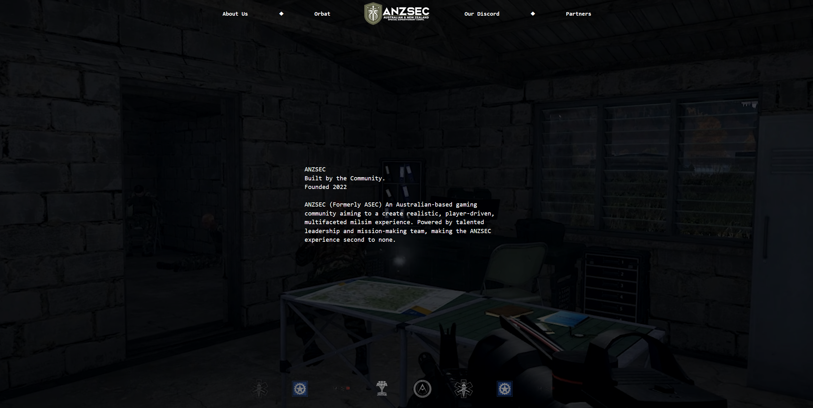

<h1 align="center">💣 ANZSEC — Arma 3 Milsim Unit Website</h1><br><br>

<br><br>

Welcome to the official website for **ANZSEC** (Australian-New Zealand Special Expeditionary Command), a tactical Arma 3 milsim unit. Created by Zaru/Khye

This is a **static, one-page website** built with [Astro](https://astro.build/) and styled using [Tailwind CSS](https://tailwindcss.com/). It is designed to introduce our unit, showcase our operations, and help new recruits find out how to join.

---

## 🎯 Purpose

This website serves as a central hub for:

- Introducing **ANZSEC** and our values as a milsim unit
- Providing an overview of our **structure, roster, and past missions**
- Offering clear instructions on **how to join our unit**
- Maintaining a sleek, modern look while staying performance-focused and accessible for both mobile and desktop

---

## 📐 Tech Stack

- ⚡️ **Astro** – Fast static site generator
- 🎨 **Tailwind CSS** – Utility-first CSS for rapid design
- 🌐 **Deployed** via GitHub Pages / Netlify / Vercel (TBD)

---

## 📂 Project Structure

```bash
├── public/             # Static assets (e.g. images, logo, trailer)
├── src/
│   ├── components/     # Reusable UI components
│   ├── layouts/        # Page layout components
│   ├── pages/          # Main .astro page
│   └── styles/         # Tailwind CSS entry file
└── astro.config.mjs
```

## 🛡 About ANZSEC

ANZSEC is a semi-serious Arma 3 milsim unit focused on immersive, story-driven operations and strong tactical coordination. Whether you’re a veteran player or just starting out, our community is built on teamwork, challenge, and fun.

## 📬 Contact & Recruitment

Check out the Join Us section of the site, or connect with us via Discord https://discord.gg/anzsecmilsim.

## 🔗 License

This project is open source and free to use under the MIT License. Open the LICENSE.md file for more.